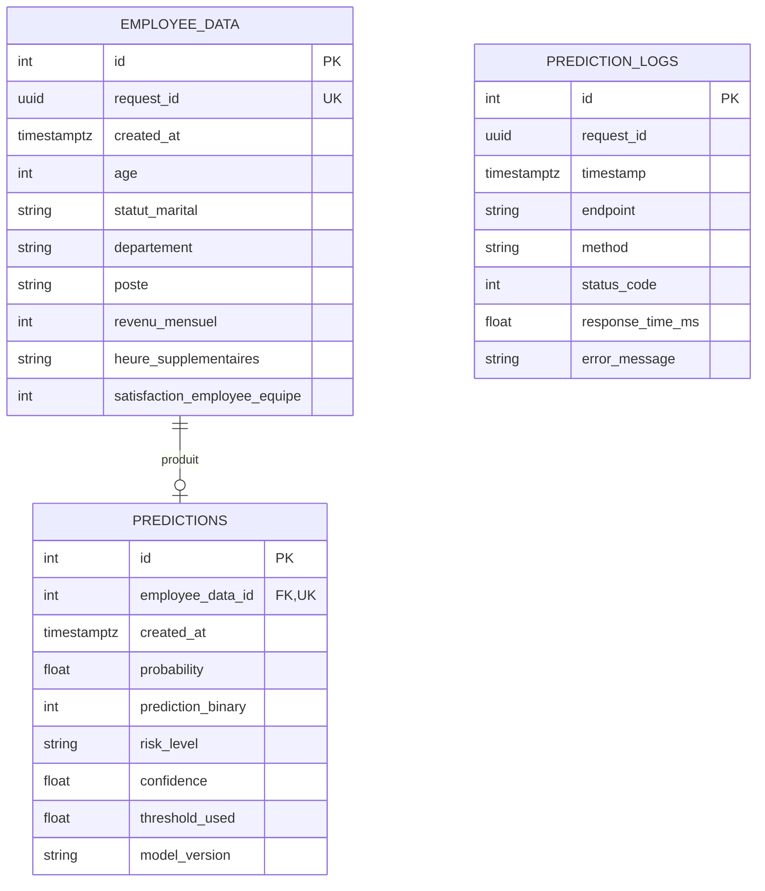

# Modèle de données PostgreSQL

## Rôles des tables

- `employee_data` stocke l'intégralité des entrées validées avant leur passage au modèle.
- `predictions` stocke exactement un résultat par entrée grâce à la contrainte `UNIQUE` sur `employee_data_id`.
- `prediction_logs` conserve la trace technique des appels, réussis ou en erreur, corrélés par `request_id`.

Les contraintes SQL contrôlent les plages essentielles et la clé étrangère est supprimée en cascade. Le script [create_db.sql](create_db.sql) et les modèles SQLAlchemy décrivent le même schéma. Le fichier `sample_inputs.csv` contient des entrées anonymisées reproductibles; `scripts/seed_database.py` les enregistre, exécute le modèle, puis persiste les sorties.
